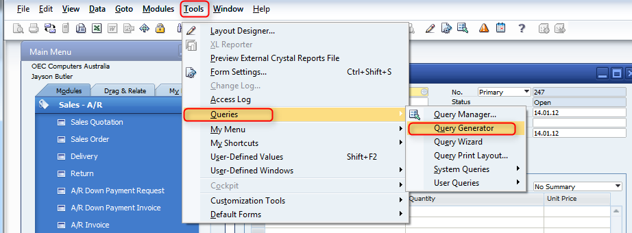
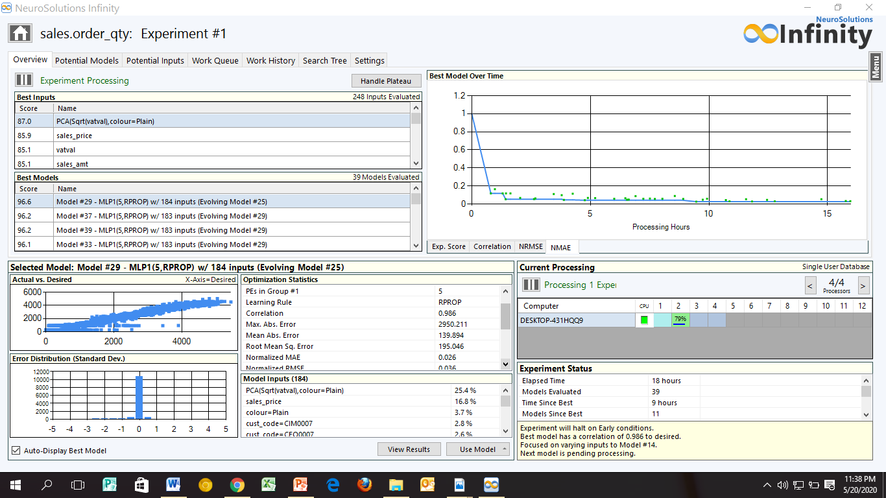

# korlokote_project
prediction of customer order amount

This research was designed for the prediction of customers order amount using the data from a product-based manufacturing outfit in Nigeria with make-to-order strategy. The raw data extracted  after  preprocessing  was divided  into training ,test ,and validation set to develop a model  to be used  in prediction of  customer  order amount. Multilayer Perceptron Artificial Neural Network architecture was implemented on two different platforms; Python and Neuro Solution Infinity Software. The results obtained using the two separate platforms were compared, with the Python implementation given 96.53 % accuracy while the Neuro Solution Infinity software gave 98.36% accuracy. The performance of the models was evaluated on the test dataset (unseen data) using the following metrics: Accuracy, Mean-Squared-Error, Mean-Absolute-Error, R2.The predictive model developed can be used for decision making in Material-Requirement-Planning system of a manufacturing system with stochastic process and make-to-order strategy.  For future work, other machine learning Algorithm such as tree algorithm (Xgboost), Random-Forest algorithm, ensemble learning could be explored to improve the model. Regularization techniques parameter such as ‘dropout’ can be explored in the construction of the neural network. Also a GUI application can be developed to deploy the model in reality.

Data Extraction: Codes can be found <a href="SQL_CODES">here</a>
  Platforms :

</img>

</img>

Data Cleaning /Preprocessing and Modelling  <a href="SalesData_Project3.ipynb">here</a>

